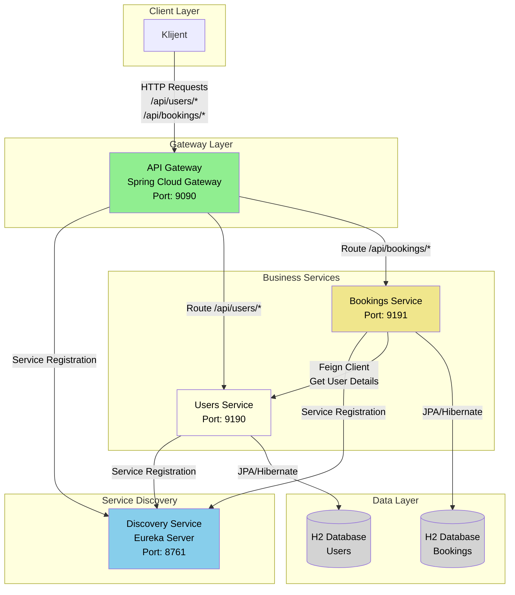

# Sistem za Rezervacije - Mikroservisna Arhitektura

## 📋 Opis Projekta

Ovaj projekat predstavlja **mikroservisni sistem za upravljanje rezervacijama** koji je implementiran koristeći Spring Boot i Spring Cloud tehnologije. Sistem omogućava upravljanje korisnicima i njihovim rezervacijama kroz distribuiranu arhitekturu.

## 🏗️ Arhitektura Sistema

Sistem se sastoji od **4 glavna mikroservisa**:

### 📋 Tabela Servisa

| Servis | Port | Rute | Odgovornosti |
|--------|------|------|--------------|
| **Discovery Service** | 8761 | `/eureka/*` | • Centralni registar servisa<br>• Service Discovery<br>• Health monitoring servisa |
| **API Gateway** | 9090 | `/api/users/*`<br>`/api/bookings/*` | • Jedinstvena tačka ulaza<br>• Rutiranje zahteva<br>• Load balancing<br>• API ključ autentifikacija |
| **Users Service** | 9190 | `/api/users/*` | • CRUD operacije za korisnike<br>• Validacija podataka<br>• H2 baza podataka |
| **Bookings Service** | 9191 | `/api/bookings/*` | • CRUD operacije za rezervacije<br>• Komunikacija sa Users Service<br>• Circuit Breaker pattern<br>• Retry mechanism |

### 🎨 Dijagram Komponenti



### 1. **Discovery Service** (Eureka Server)
- **Port:** 8761
- **Funkcija:** Centralni registar servisa koji omogućava automatsko otkrivanje i registraciju mikroservisa
- **URL:** http://localhost:8761

### 2. **API Gateway** (Spring Cloud Gateway)
- **Port:** 9090
- **Funkcija:** Jedinstvena tačka ulaza za sve API pozive, rutiranje zahteva ka odgovarajućim servisima
- **URL:** http://localhost:9090
- **API ključ:** `tajnikljuc123`

### 3. **Users Service**
- **Port:** 9190
- **Funkcija:** Upravljanje korisnicima (CRUD operacije)
- **Baza podataka:** H2 in-memory baza
- **H2 Console:** http://localhost:9190/h2-console

### 4. **Bookings Service**
- **Port:** 9191
- **Funkcija:** Upravljanje rezervacijama (CRUD operacije)
- **Baza podataka:** H2 in-memory baza
- **H2 Console:** http://localhost:9191/h2-console
- **Dodatne funkcionalnosti:** Circuit Breaker pattern, Retry mechanism, Feign client

## 🛠️ Tehnologije

- **Java 17**
- **Spring Boot 3.4.10**
- **Spring Cloud 2024.0.0**
- **Spring Cloud Gateway** - API Gateway
- **Netflix Eureka** - Service Discovery
- **Spring Data JPA** - Persistence layer
- **H2 Database** - In-memory baza podataka
- **Lombok** - Code generation
- **ModelMapper** - Object mapping
- **Resilience4j** - Circuit Breaker i Retry patterns
- **OpenFeign** - HTTP client za komunikaciju između servisa
- **Maven** - Dependency management

## 📊 Struktura Podataka

### User Entity
```json
{
  "id": 1,
  "name": "Marko Petrović",
  "email": "marko@example.com"
}
```

### Booking Entity
```json
{
  "id": 1,
  "userIds": [1, 2, 3],
  "status": "CONFIRMED",
  "bookingDate": "15-12-2024",
  "details": "Rezervacija za restoran"
}
```

### Booking Status
- `CONFIRMED` - Potvrđena rezervacija
- `PENDING` - Rezervacija na čekanju
- `CANCELLED` - Otkazana rezervacija

## 🚀 Pokretanje Servisa

### ⚠️ VAŽNO: Redosled pokretanja

**Servisi MORAJU biti pokrenuti u sledećem redosledu:**

### 1. Discovery Service (OBVEZNO PRVI)
```bash
cd discovery-service
mvn spring-boot:run
```
- **Port:** 8761
- **Status:** Čekajte da se servis potpuno pokrene (obično 30-60 sekundi)
- **Provera:** Idite na http://localhost:8761 da potvrdite da Eureka server radi

### 2. API Gateway
```bash
cd api-gateway
mvn spring-boot:run
```
- **Port:** 9090
- **Status:** Čekajte da se registruje u Discovery Service

### 3. Users Service
```bash
cd users-service
mvn spring-boot:run
```
- **Port:** 9190
- **Status:** Čekajte da se registruje u Discovery Service

### 4. Bookings Service
```bash
cd bookings-service
mvn spring-boot:run
```
- **Port:** 9191
- **Status:** Čekajte da se registruje u Discovery Service

## 🔍 Provera Statusa

### Eureka Dashboard
- **URL:** http://localhost:8761
- **Funkcija:** Pregled svih registrovanih servisa

### H2 Database Console
- **Users Service:** http://localhost:9190/h2-console
  - JDBC URL: `jdbc:h2:mem:usersdb`
  - Username: `sa`
  - Password: (prazno)
- **Bookings Service:** http://localhost:9191/h2-console
  - JDBC URL: `jdbc:h2:mem:bookingsdb`
  - Username: `sa`
  - Password: (prazno)

## 📡 API Endpoints

### Kroz API Gateway (http://localhost:9090)

#### Users Service
- `GET /api/users` - Dobijanje svih korisnika
- `GET /api/users/{id}` - Dobijanje korisnika po ID
- `POST /api/users` - Kreiranje novog korisnika
- `PUT /api/users/{id}` - Ažuriranje korisnika
- `DELETE /api/users/{id}` - Brisanje korisnika

#### Bookings Service
- `GET /api/bookings` - Dobijanje svih rezervacija
- `GET /api/bookings/{id}` - Dobijanje rezervacije po ID
- `POST /api/bookings` - Kreiranje nove rezervacije
- `PUT /api/bookings/{id}` - Ažuriranje rezervacije
- `DELETE /api/bookings/{id}` - Brisanje rezervacije
- `GET /api/bookings/with-users` - Dobijanje rezervacija sa informacijama o korisnicima

### Direktni pristup servisima

#### Users Service (http://localhost:9190)
- Svi endpoints su isti kao kroz API Gateway, samo bez `/api` prefiksa

#### Bookings Service (http://localhost:9191)
- Svi endpoints su isti kao kroz API Gateway, samo bez `/api` prefiksa

## 🔧 Konfiguracija

### API Gateway
- **API ključ:** `tajnikljuc123` (definisan u application.yml)
- **Rutiranje:** Automatsko rutiranje na osnovu URL putanje

### Circuit Breaker (Bookings Service)
- **Sliding window size:** 5 poziva
- **Failure rate threshold:** 50%
- **Wait duration:** 5 sekundi
- **Retry attempts:** 3 puta sa 2 sekunde pauze

## 🧪 Testiranje

### Kreiranje korisnika
```bash
curl -X POST http://localhost:9090/api/users \
  -H "Content-Type: application/json" \
  -d '{
    "name": "Marko Petrović",
    "email": "marko@example.com"
  }'
```

### Kreiranje rezervacije
```bash
curl -X POST http://localhost:9090/api/bookings \
  -H "Content-Type: application/json" \
  -d '{
    "userIds": [1],
    "status": "CONFIRMED",
    "bookingDate": "15-12-2024",
    "details": "Rezervacija za restoran"
  }'
```
